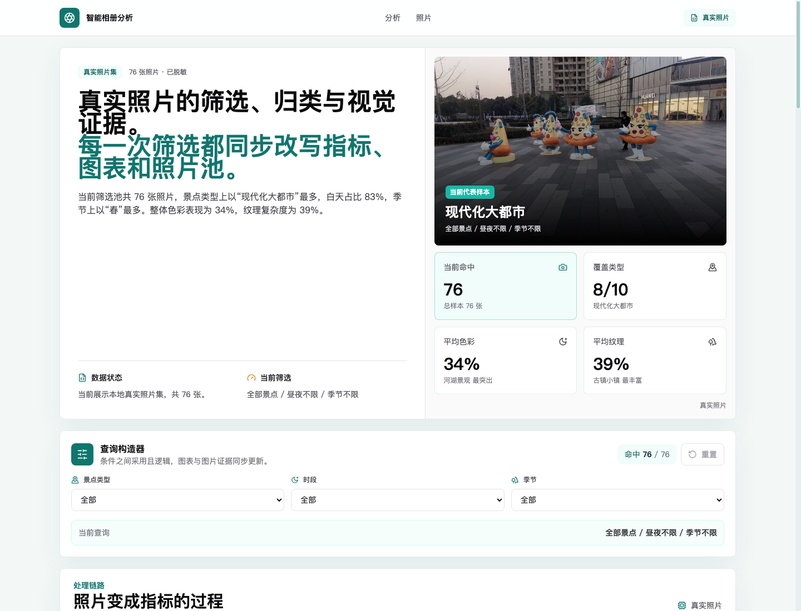

# 智能相册分析系统完整交付文档

**交付版本：** 课程提交候选版  
**交付日期：** 2026 年 7 月 13 日  
**代码分支：** `main`  
**项目状态：** 代码、演示页面、测试、文档与答辩 PPT 已齐备，可生成最终课程提交压缩包

## 1. 交付说明

智能相册分析系统用于把真实照片库转换为可筛选、可解释、可核对的数据分析结果。系统以 76 张脱敏照片作为公开展示集，提供景点类型、拍摄时段、季节、色彩分值和纹理复杂度等维度的统计分析，并将结论、图表与真实图片证据联动展示。

本次交付包括：

- 可在线访问的 React 数据分析界面。
- 可双击打开的自包含单文件 HTML 演示。
- Flask 后端源码、统一照片 API、媒体接口和三级统计。
- 76 条分析数据与 76 张脱敏展示图片。
- 项目说明、API、测试、运行、数据规范和部署文档。
- 自动校验、单文件生成和最终压缩包生成脚本。

景点分类和图像特征属于 EXIF、文件时间、GPS 地址关键词和像素特征规则构成的启发式分析，不应描述为已经训练完成的深度学习模型。

## 2. 演示入口

### 2.1 在线演示

- Vercel：<https://intelligent-album-demo.vercel.app>
- 腾讯云：<https://graduate-sim-d6gl5fih109ef4a1f.service.tcloudbase.com/album-demo>
- GitHub：<https://github.com/1205240810/intelligent-album-demo>

腾讯云测试域名首次访问可能出现提示页，确认访问后即可进入。在线页面展示脱敏静态数据；上传与实时分析需要启动本地 Flask 后端。

### 2.2 离线演示

最终压缩包解压后，双击：

```text
01_直接演示/智能相册分析.html
```

该文件已内嵌数据、样式、脚本和 76 张图片，不需要安装 Node.js、Python，也不需要启动后端。

### 2.3 演示界面



界面保持“总览与核心结论 -> 多维筛选 -> 数据处理链路 -> 证据与图表 -> 真实图片库”的讲解顺序。当前设计使用白色基底、青绿色主色和琥珀色辅助色，兼顾课程答辩的清晰度与数据产品的可读性。

## 3. 核心功能

### 3.1 数据总览

- 展示照片总数、覆盖类型、平均色彩和平均纹理。
- 首屏使用当前筛选池的真实代表图片。
- 自动生成与当前数据一致的自然语言结论。
- 明确显示数据来自 API、本地 JSON 或临时样本。

### 3.2 多维筛选

- 按景点类型、白天/黑夜、春夏秋冬筛选。
- 多个条件采用“且”逻辑。
- 筛选后命中数、KPI、结论、四张图表和图片库同步更新。
- 当前无夏季样本时显示真实 0 张空状态，不用 Mock 数据伪装成功。

### 3.3 数据可视化

- 景点分布饼图。
- 昼夜对比柱状图。
- 季节分布柱状图。
- 色彩-纹理象限散点图。

图表使用 ECharts 6 按需注册组件，并通过异步模块加载降低首屏 JavaScript 体积。

### 3.4 图片证据库

- 所有卡片均引用真实脱敏照片。
- 首批加载 24 张，每次继续加载 24 张。
- 全部 76 张数据始终参与统计和图表计算。
- 点击图片可查看编号、类别、时段、季节、色彩和纹理。
- 弹窗支持 Escape 关闭、焦点返回和移动端内部滚动。

### 3.5 后端照片处理

- 用户注册、相册创建、照片上传和删除。
- 图片扩展名与真实内容双重验证。
- 同名图片自动生成唯一文件名。
- EXIF 时间、设备和 GPS 解析。
- 配置百度地图 AK 后执行 GPS 地址反查。
- 生成 JPEG 缩略图并移除公开副本中的 EXIF。
- 相册、用户和平台三级统计同步维护。
- `/api/photos` 输出前端统一数据，`/media` 提供合法图片资源。

## 4. 系统架构

```text
原始照片
  |-- EXIF / 文件时间 ------> 季节与昼夜
  |-- GPS / 地址反查 ------> 景点关键词映射
  |-- HSV / 灰度边缘 ------> 色彩与纹理分值
  v
统一照片数据
  |-- Flask /api/photos
  |-- 静态 data.json
  |-- 单文件内嵌数据
  v
React 数据状态与筛选
  |-- KPI 与自然语言结论
  |-- ECharts 可视化
  |-- 真实图片证据库
```

### 4.1 前端技术栈

| 技术 | 用途 |
| --- | --- |
| React 18 | 状态、筛选联动和组件组织 |
| Vite 6 | 开发、生产构建和单文件构建 |
| Tailwind CSS 3 | 响应式布局和视觉系统 |
| ECharts 6 | 饼图、柱状图和散点图 |
| lucide-react | 界面图标 |

### 4.2 后端技术栈

| 技术 | 用途 |
| --- | --- |
| Flask 3 | HTTP API、CORS 和媒体响应 |
| Pillow | 图片验证、缩略图和像素特征 |
| exifread | EXIF 时间、设备和 GPS 信息 |
| requests | 百度地图逆地理编码请求 |
| python-dotenv | 读取本机私有配置 |
| JSON 文件 | 课程演示所需元数据和三级统计 |

## 5. 数据与算法口径

### 5.1 数据集

- 公开记录：76 条。
- 公开图片：76 张。
- 重复 ID：0。
- 缺失或未引用图片：0。
- 展示图片已重新编码，未检测到 EXIF/GPS。
- 701MB 原始照片只保存在本地 `data/raw/`，不进入 GitHub 和最终压缩包。

### 5.2 昼夜判断

拍摄时间优先来自文件名 `IMG_YYYYMMDD_HHMMSS`，其次读取 EXIF；后端缺失时使用文件修改时间。

```text
06:00 <= hour < 18:00 -> 白天
其他时间               -> 黑夜
```

### 5.3 季节判断

```text
3-5 月   -> 春
6-8 月   -> 夏
9-11 月  -> 秋
12-2 月  -> 冬
```

### 5.4 景点类型

离线生成器根据 HSV 颜色比例、亮度、暗部比例和边缘强度执行轻量规则判断。后端实时流程优先结合已有元数据、GPS 地址反查和关键词，例如“海、岛、沙滩”映射海景，“寺、庙、塔、遗址”映射历史古迹。

### 5.5 色彩分值

设平均饱和度为 `S`、平均亮度为 `V`、暗像素比例为 `D`：

```text
color_score = clamp(0.68 * S + 0.24 * V + 0.08 * (1 - D), 0, 1)
```

该指标用于描述综合色彩活跃程度，不代表照片美学质量。

### 5.6 纹理复杂度

图片转为灰度图并使用边缘滤镜，设归一化平均边缘强度为 `E`：

```text
texture_complexity = clamp(3.1 * E, 0, 1)
```

边缘越密集，分值通常越高；天空和海面等平滑区域通常较低。

## 6. 当前分析结论

| 指标 | 当前结果 |
| --- | --- |
| 现代化大都市 | 30 张，39.5% |
| 历史古迹 | 20 张，26.3% |
| 海景 | 13 张，17.1% |
| 白天 | 63 张，82.9% |
| 黑夜 | 13 张，17.1% |
| 春季 | 59 张，77.6% |
| 平均色彩分值 | 34.4% |
| 平均纹理复杂度 | 39.3% |

当前样本主要记录城市和历史建筑，白天与春季照片占比较高。海景与绿植照片通常有更明显的色彩表现，古镇和建筑细节对纹理指标贡献更明显。以上结论只描述当前 76 张样本，不能外推为所有旅行照片的普遍规律。

## 7. API 概览

| 方法 | 路径 | 用途 |
| --- | --- | --- |
| GET | `/api/photos` | 获取统一照片分析数据 |
| GET | `/media/<safe-path>` | 获取后端相册图片 |
| POST | `/register` | 创建用户 |
| POST | `/create_album` | 创建相册 |
| POST | `/upload` | 上传并分析图片 |
| POST | `/delete_photo` | 删除照片并更新统计 |
| POST | `/delete_album` | 删除相册并更新统计 |
| POST | `/delete_user` | 删除用户并更新统计 |
| GET | `/stats/album` | 获取相册统计 |
| GET | `/stats/user` | 获取用户统计 |
| GET | `/stats/platform` | 获取平台统计 |

正式字段、请求示例和状态码见 `API_CONTRACT.md`。

## 8. 安全与隐私

- 用户名、相册名和媒体路径经过边界校验，拒绝目录穿越。
- 非 JSON 请求、伪图片、非法扩展名和超限上传有明确错误响应。
- JSON 使用临时文件、`fsync` 和原子替换，降低写入中断风险。
- 删除前校验物理照片数与统计数，数据不一致时返回 409。
- 百度地图 AK 只保存在被 Git 忽略的 `.env.local` 或部署环境变量中。
- `.env.local`、原始照片、运行态用户数据、Git 历史和依赖目录不进入课程包。

## 9. 运行指南

### 9.1 前端

```bash
npm ci --prefix frontend
npm run dev
```

访问：<http://127.0.0.1:5173/>

### 9.2 后端

```bash
python3 -m venv backend/photo_album/.venv
backend/photo_album/.venv/bin/pip install -r backend/photo_album/requirements.txt
cp backend/photo_album/.env.example backend/photo_album/.env.local
npm run backend:dev
```

后端默认地址：<http://127.0.0.1:8080/>

### 9.3 前后端联调

复制 `frontend/.env.example` 为 `frontend/.env.local`，配置：

```text
VITE_PHOTO_DATA_API_URL=http://127.0.0.1:8080/api/photos?username=张三&album_name=我的照片
```

数据加载顺序为 API -> 本地 JSON -> 临时样本。API 返回 `photos: []` 属于合法空状态，不触发本地数据回退。

## 10. 测试与验收结果

| 检查 | 结果 |
| --- | --- |
| 前端逻辑测试 | 5 项通过 |
| 后端 API 测试 | 6 项通过 |
| Python 语法检查 | 通过 |
| 数据与图片校验 | 76 条、76 图、EXIF clean |
| npm 安全审计 | 0 个漏洞 |
| 生产构建 | 通过 |
| 自包含单文件构建 | 通过，约 11.6MB |
| Edge `file://` 直开 | 通过 |
| 390 / 768 / 1440 响应式 | 通过，无横向溢出 |
| 空筛选与弹窗 | 通过 |

完整记录见 `TEST_REPORT.md`。

## 11. 最终提交包

```text
智能相册分析系统-课程作业/
├── 00_请先阅读.md
├── 01_直接演示/
│   └── 智能相册分析.html
├── 02_项目源码/
│   ├── frontend/
│   ├── backend/
│   ├── docs/
│   ├── scripts/
│   ├── package.json
│   ├── README.md
│   └── vercel.json
├── 03_项目文档/
│   ├── 完整交付文档.docx
│   ├── 完整交付文档.md
│   ├── 演示界面.png
│   ├── 项目说明书.md
│   ├── 测试报告.md
│   ├── 演示与运行指南.md
│   └── API接口说明.md
├── 04_答辩材料/
│   └── 智能相册分析系统-答辩.pptx
└── 文件清单与校验值.txt
```

答辩 PPT 已复制到标准位置：

```text
submission/智能相册分析系统-答辩.pptx
```

执行：

```bash
npm run package:submission
```

脚本会重新执行项目验证、生成单文件演示、校验 PPT、复制源码和文档、生成 SHA-256 清单并压缩。PPT 缺失、损坏或压缩包超过 100MB 时会明确失败，不生成容易误交的残缺文件。

> 答辩一致性提醒：当前 PPT 中出现了 Intel 图像数据集、PyTorch/CNN、PCA 和 t-SNE 等表述，而本仓库当前可验证实现是 76 张脱敏真实照片、EXIF/GPS/文件时间解析与像素特征启发式分析。压缩包会按组员提供的原始 PPT 收录，不擅自改写；正式答辩前应统一 PPT 口径与实际代码，避免评委按 PPT 追问仓库中不存在的训练流程。

## 12. 提交前检查清单

- [x] 76 条 JSON 与 76 张展示图一一对应。
- [x] 公开图片不含 EXIF/GPS。
- [x] 前端与后端自动化测试通过。
- [x] 生产构建和单文件离线构建通过。
- [x] 390、768、1440 响应式验收通过。
- [x] GitHub 与 Vercel 提供公开入口。
- [x] 私有密钥未进入 GitHub。
- [x] 组员答辩 PPT 已放入 `submission/`，文件结构与 20 页幻灯片通过完整性检查。
- [x] PPT 已作为原始答辩材料纳入压缩包；提交前仍建议由汇报人用 PowerPoint 人工确认字体、媒体和动画效果。
- [x] 已执行 `npm run package:submission`，最终 ZIP 约 45MB，低于 100MB 交付目标。
- [x] 已在新目录解压最终 ZIP，复核目录结构、PPT、Word 文档、校验清单和离线演示文件。

## 13. 已知边界与改进方向

- JSON 文件存储适合课程演示，不适合多用户高并发场景。
- 当前没有登录鉴权，Flask 服务不应直接暴露为生产公网接口。
- 景点分类依赖可解释规则，尚未建立人工标注集和分类准确率指标。
- GPS 反查依赖照片元数据和第三方地图服务。
- 当前样本中夏季、瀑布、山景等类别不足，数据分布不均衡。
- 后续可迁移 SQLite/关系数据库，接入正式图像分类模型，并增加数据标注与准确率评估。

## 14. 交付结论

当前版本已经具备完整的课程演示闭环：真实照片输入、元数据与像素特征处理、统一数据接口、交互筛选、统计结论、可视化图表、图片证据、离线演示、自动测试和提交包生成。代码、数据、文档、演示材料与组员答辩 PPT 均已纳入最终交付流程。
