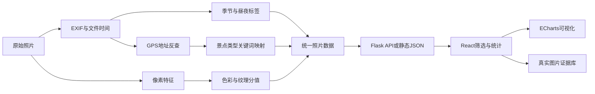

# 智能相册分析系统项目说明书

## 1. 项目概述

本项目围绕“如何把普通照片库转化为可解释的数据分析结果”展开。系统保留真实照片作为证据，通过拍摄时间、EXIF、GPS 地址、类别标签以及颜色和纹理特征，生成可交互筛选、统计图表和图片详情。

项目同时支持三种交付方式：React 在线页面、Flask 实时接口和不依赖安装环境的单文件离线演示。

## 2. 系统架构



### 前端

- React 负责数据状态、筛选联动、结论生成和图片详情。
- Vite 负责开发、生产构建和离线构建。
- Tailwind CSS 负责响应式布局和视觉系统。
- ECharts 负责饼图、柱状图和散点图，并通过异步模块降低首屏体积。

### 后端

- Flask 提供上传、删除、统计、照片数据和媒体接口。
- Pillow 负责图片验证、缩略图和像素特征。
- exifread 负责拍摄时间、设备和 GPS 元数据。
- 百度地图接口在配置 AK 时执行 GPS 地址反查；未配置时系统仍可运行。
- JSON 文件保存课程演示所需的用户、相册和平台统计。

## 3. 数据处理方法

### 3.1 时间与季节

拍摄时间优先来自文件名 `IMG_YYYYMMDD_HHMMSS`，其次读取 EXIF；后端缺失时使用文件修改时间。

- `06:00 <= hour < 18:00` 判定为白天，其余为黑夜。
- 3–5 月为春，6–8 月为夏，9–11 月为秋，12–2 月为冬。

### 3.2 景点类型

离线数据生成器使用 HSV 颜色比例、亮度、暗部比例和边缘强度执行轻量规则判断。后端实时流程优先使用已有元数据和 GPS 地址关键词，例如“海、岛、沙滩”映射海景，“寺、庙、塔、遗址”映射历史古迹。

该分类属于可解释的启发式方法，适合课程演示和模型缺失时兜底，不等同于训练后的计算机视觉分类器。

### 3.3 色彩分值

设平均饱和度为 `S`、平均亮度为 `V`、暗像素比例为 `D`：

```text
color_score = clamp(0.68 × S + 0.24 × V + 0.08 × (1 - D), 0, 1)
```

该指标描述画面综合色彩活跃程度，不代表美学质量。

### 3.4 纹理复杂度

将图片转换为灰度图并使用 `FIND_EDGES` 获取边缘图，设归一化平均边缘强度为 `E`：

```text
texture_complexity = clamp(3.1 × E, 0, 1)
```

边缘越密集，分值通常越高；天空、海面等平滑区域通常较低。

## 4. 当前数据结果

公开展示集包含 76 张真实脱敏图片：

| 指标 | 结果 |
| --- | --- |
| 现代化大都市 | 30 张，39.5% |
| 历史古迹 | 20 张，26.3% |
| 海景 | 13 张，17.1% |
| 白天 | 63 张，82.9% |
| 黑夜 | 13 张，17.1% |
| 春季 | 59 张，77.6% |
| 平均色彩分值 | 34.4% |
| 平均纹理复杂度 | 39.3% |

由此可以得到三点观察：样本主要记录城市和历史建筑；白天、春季样本占比较高；海景与绿植照片通常拥有更明显的色彩表现，古镇和建筑细节对纹理指标贡献更明显。

这些结论只描述当前样本，不应外推为所有旅行照片的普遍规律。

## 5. 工程设计

- API、本地 JSON、内嵌数据和临时样本采用明确的降级顺序。
- API 返回空数组时保持真实空状态，避免把联调失败伪装成成功。
- 公开图片重新编码为 JPEG，去除 EXIF 和 GPS。
- 后端所有文件路径经过边界校验；上传文件经过扩展名和真实图片双重验证。
- JSON 使用临时文件和原子替换写入，降低写入中断造成文件损坏的风险。
- 同名上传生成唯一文件名，删除流程同步维护三级统计。

## 6. 局限性与改进方向

- JSON 存储不适合并发用户，后续可迁移到 SQLite 或关系数据库。
- 当前没有账户鉴权，接口仅适合可信环境中的课程演示。
- 景点分类依赖规则，后续可接入正式图像分类模型并建立人工标注验证集。
- GPS 反查依赖第三方服务和照片元数据，缺少 GPS 时只能使用视觉或默认规则。
- 当前数据分布不均衡，夏季、瀑布和山景样本不足，后续应补充数据并报告分类准确率。

## 7. 交付形式

- GitHub：保存源码、脱敏展示图片和文档。
- Vercel：提供公开在线前端。
- 腾讯云 CloudBase：提供国内网络备用入口。
- 单文件 HTML：内嵌数据、脚本、样式和 76 张压缩图片，双击即可演示。
